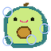

## Play the game hosted on Render
# https://avocado-bubbles-free.onrender.com/

Replit source: https://replit.com/@jwsy/avocado-bubbles-free

Welcome! Kaboom is a JavaScript library that helps you make games fast and fun :D

This is a Kaboom.js game to entertain toddlers (use that Guided Access mode) with sounds provided by my three-year-old kiddo who loves avocados and putting out fires.  Easter eggs:  - s - show stats for nerds - t - engage TURBO MODE 

Play the game locally!
----------------------
Install node LTS, [I follow these instructions to use nvm for my node version control.](https://heynode.com/tutorial/install-nodejs-locally-nvm/)

The dist is built in JS with nodejs (using *esbuild*) by running `node run.js`. This builds and runs the server. Stop the server `^c`

Automatic Build
---------------
1. Update `package.json` to include all of your dependencies and then do a `npm i` to install dependencies. The current version (as of Sep 2022) doesn't update this file based on the dependencies installed.
1. Build the game with `node run-build.js` and then serve the `dist/` dir (easiest if python is installed is `python -mSimpleHTTPServer` or `python3 -mhttp.server`). 
1. The `run-build.js` script will put all the necessary files in `dist/`
1. Grok the `Dockerfile` and `fly.toml` files to see how the assets in the `dist/` folder is pushed to the container image and ports are forwarded.
1. Build & deploy with fly.io by doing a `flyctl deploy` to build & deploy it.